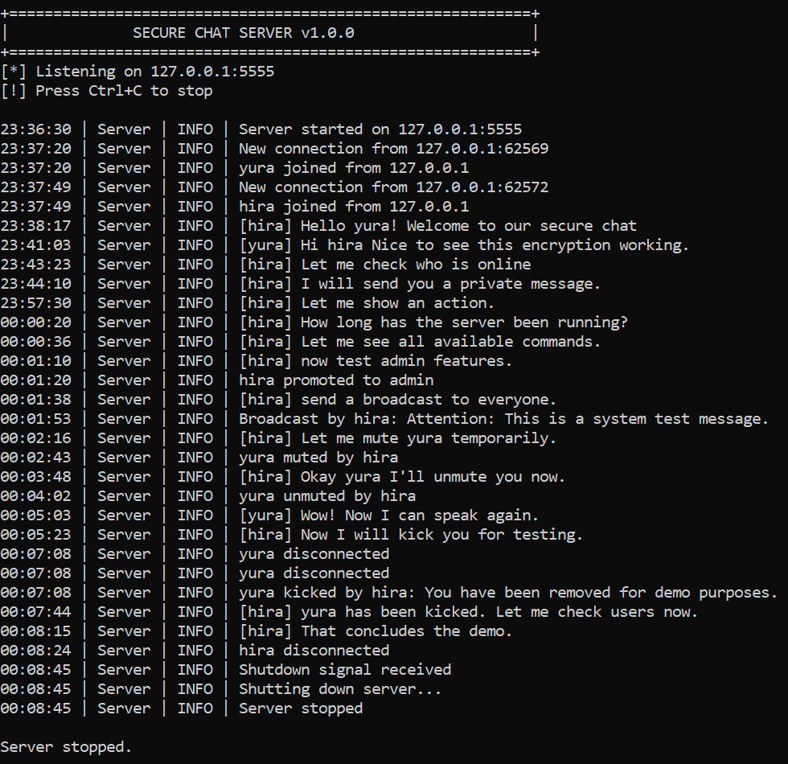
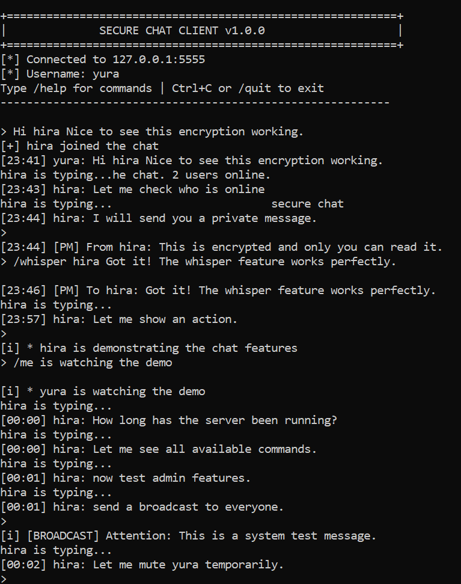
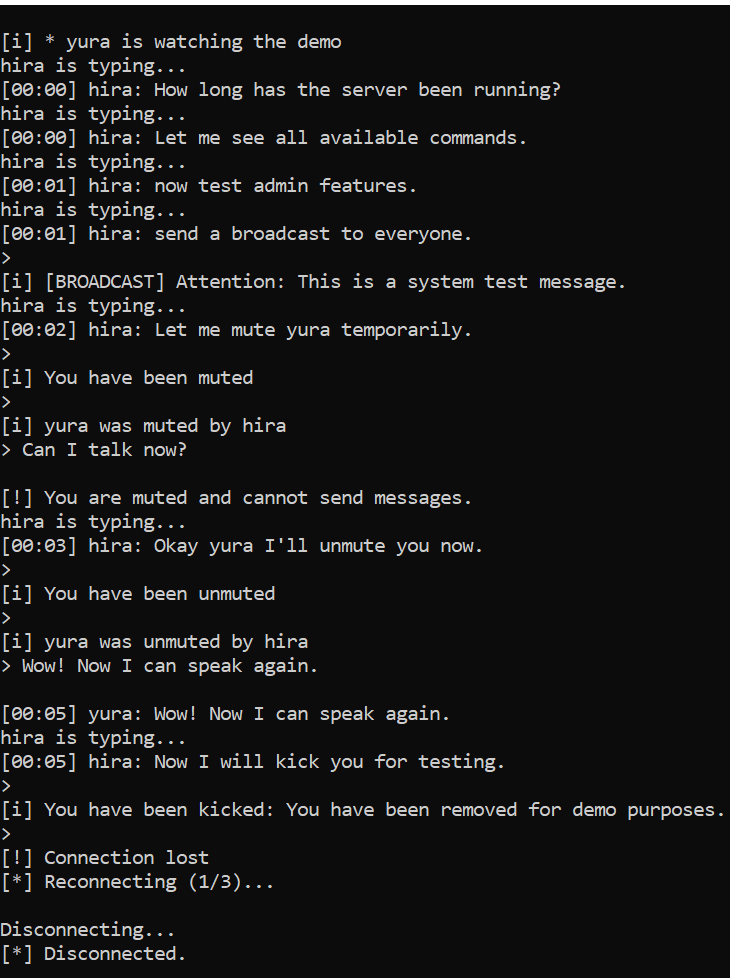
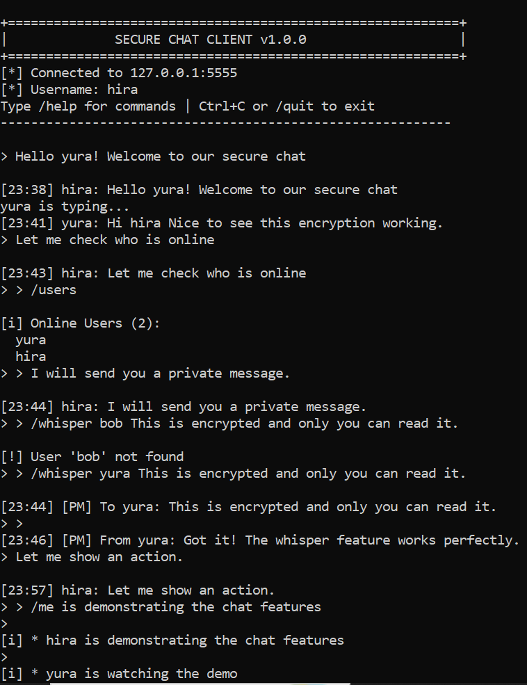
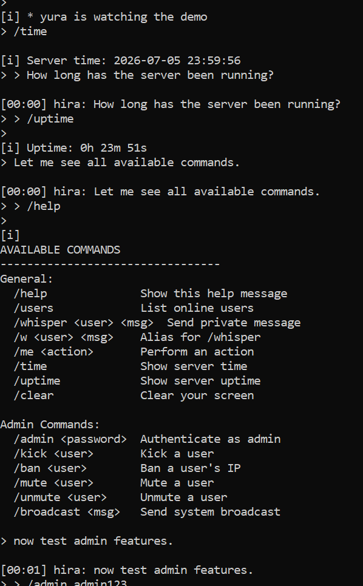
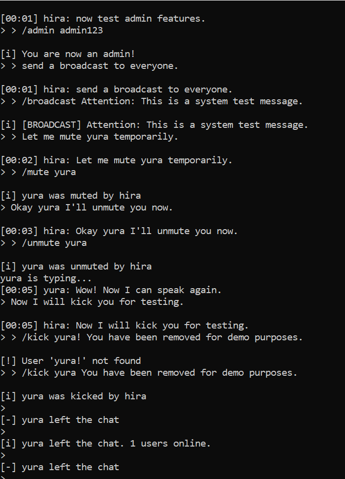
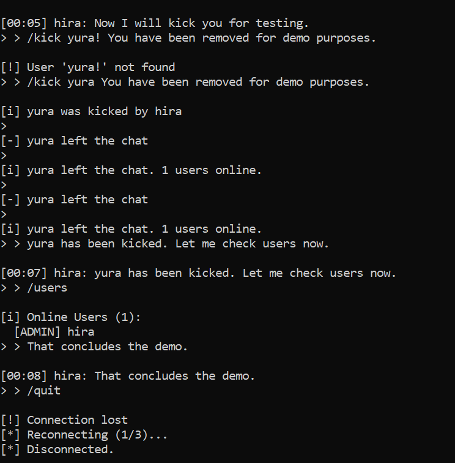

# SecureChat - Encrypted Chat Application

A production-grade, multi-client encrypted chat application built with Python using AES-128-CBC encryption via Fernet.

## Features

- **AES-128-CBC Encryption** via Fernet (symmetric encryption)
- **Multi-Client Support** with threading
- **Private Messaging** (Whisper)
- **Admin Controls** - Kick, Ban, Mute, Unmute, Broadcast
- **Rate Limiting** - Spam protection
- **Typing Indicators**
- **Message History**
- **Heartbeat Keep-Alive**
- **Structured Logging**

## Project Structure

## Demo Screenshots

### 1. Server Running with Multiple Clients

### 2. yura client

### 3. yura replies

### 3. hira send messages

### 4. users commands

### 5. admin commands

### 6. admin commands 2

